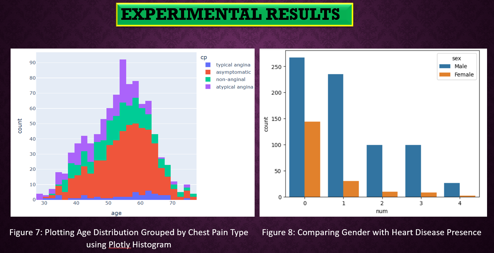

# Heart Disease Prediction Using Machine Learning

## Project Overview
This project predicts heart disease using Random Forest and XGBoost on the Cleveland dataset. It focuses on data cleaning, visualization, feature analysis, and model evaluation.

## Objectives
- Predict heart disease with high accuracy
- Perform data preprocessing and feature analysis
- Evaluate model performance using metrics and visualizations

## Tools & Technologies
- Python
- Pandas, NumPy
- Matplotlib, Seaborn
- Scikit-learn
- Google Colab

## Key Steps Performed
- Data loading and cleaning
- Exploratory Data Analysis (EDA)
- Feature engineering
- Model building with Random Forest and XGBoost
- Performance evaluation (accuracy, confusion matrix)

## Dataset
- Cleveland Heart Disease Dataset (`heart.csv`)
- Each CSV represents structured data used for prediction

## Output / Visuals

## Outcome
- Built a model achieving **83% accuracy**
- Identified key features contributing to heart disease
- Visualized performance metrics and predictions

## Notes
This report was originally submitted as part of academic requirements and is shared here for learning and portfolio purposes.
The roll number appears as part of the original college submission and has not been altered.
